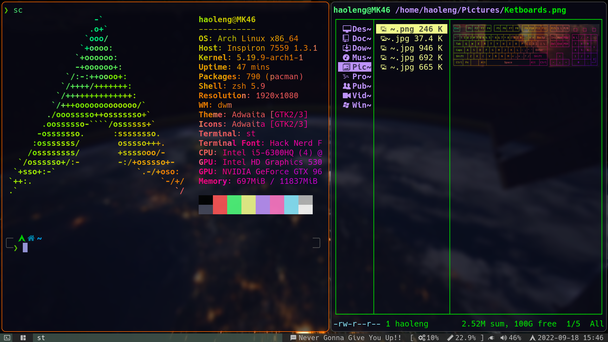

# HELLO
这是我的xorg环境下的dwm和st的源码和配置文件，编译`make clean install`即可食用
+ 安装字体 nerd-fonts-hack 解决字体乱码问题
+ 安装驱动 例如显卡驱动`xf86-video-intel`,`xf86-video-amdgpu`解决屏幕亮度,声卡驱动`alsa-utils`解决音量问题
+ 安装`redshift`实现色温调整功能
+ dwm自启动脚本、picom合成器配置和ranger的配置文件 `.dwm`放到`home`下，`picom/`和`ranger/`放到`~/.config/`下
截图如下：

