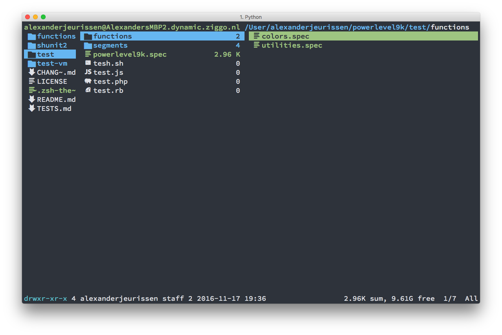

# ranger
--------

ranger 是一个基于文本的由 Python 编写的文件管理器。
不同层级的目录分别在一个面板的三列中进行展示.
可以通过快捷键(vim风格), 书签, 鼠标以及历史命令在它们之间移动. 

--------
效果如下：


--------
该ranger配置下的一些常用的快捷键：
```C
<F7>    		//mkdir
cw      		//重命名
yy      		//复制
dd      		//剪切
pp      		//粘贴
dD      		//删除
DD 			//将选中的文件移动到~/.locale/share/Trash/files下
			//类似废纸篓效果
v / 空格       	       //反选/全选
/       		//搜索（tab切换下一个）
zh      		//显示隐藏文件
du      		//显示大小
o       		//排序
q       		//退出
ctrl+n  		//多标签
shift+s 		//进入当前目录
m 			//为当前目录建立书签
`			//打开并进入书签
```

--------
ranger预览文件需要的软件包:

|        软件         |  预览项目  |
| :-----------------: | :--------: |
|  ffmpegthumbnailer  |    视频    |
| p7zip, unzip, atool |  压缩文件  |
|    ueberzug, w3m    | 图片，网页 |
|   catdoc, pandoc    |  word文档  |
|      highlight      |  代码高亮  |

> enjoy your life!
